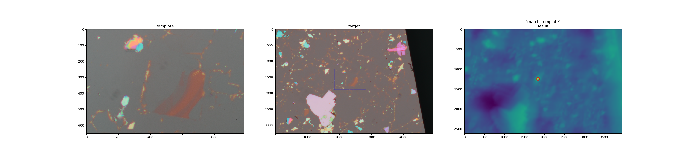

# Image template matching
A basic script to aide automated collection of two-dimensional materials. Motivated by projects in the [Velasco lab](https://jvjlab.sites.ucsc.edu/)

## Instructions (*nix systems)
 - Install conda
 - Run `make install` to install the conda environment
 - Run `conda activate image_templating` to activate the conda environment
 - `python3 match_template.py --help` for further instructions.

 ## Example:

 First activate the conda environment:

`activate image_templating`

Run the script (writing output images to `static/outputs` in this example):

 `(image_templating) python3 match_template.py --template "static/examples/1\ H_Z.jpg" --target "static/examples/1\ H.jpg" --output_dir "static/outputs" --do_render_figures`

 The (x, y, height, width) coordinates of the bounding box will be printed to stdout on running the script (where x,y is the lower left corner of the box).
 
